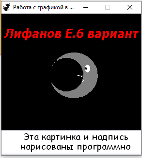

# LEU_Lab5
| Фамилия, имя студента | Группа    | Дисциплина  |Тема                              
| --------------------- |:---------:| ------------|:--------------------------------:|
| Лифанов Евгений     | ИС-302    | СВП         |5.Работа с графикой и системой|Задание:Нарисовать рисунок. 

Как выглядит визуально выглядит программа: 

